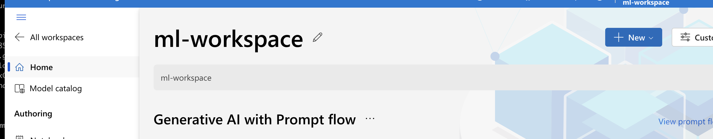
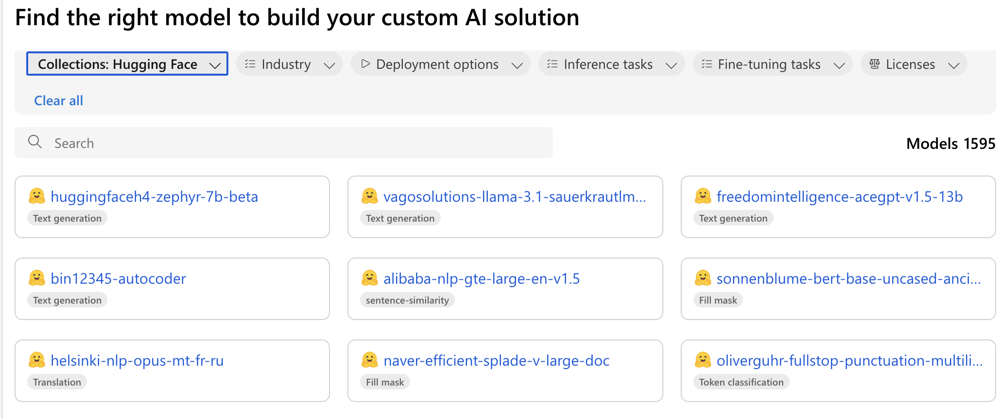

## Supported Models

Magemaker currently supports two model sources for deployment:

1. **Hugging Face Models** - Deploy any public or gated model from Hugging Face Hub
2. **Custom Models** - Deploy your own fine-tuned models from S3 or local paths

<Note>
AWS SageMaker JumpStart models are supported for **fine-tuning only**, not for direct deployment via Magemaker. Cloud provider marketplace models (GCP Vertex AI Model Garden, Azure ML Model Catalog) are not yet supported for deployment.
</Note>

### Hugging Face Models

<CardGroup>
  <Card title="Text Generation" icon="pen-to-square" href="https://huggingface.co/models?pipeline_tag=text-generation">
    - LLaMA
    - BERT
    - GPT-2
    - T5
  </Card>
  
  <Card title="Feature Extraction" icon="vector-square" href="https://huggingface.co/models?pipeline_tag=feature-extraction">
    - Sentence Transformers
    - CLIP
    - DPR
  </Card>
</CardGroup>

### Future Support

We plan to add support for the following model sources:

<CardGroup>
  <Card title="AWS SageMaker" icon="aws">
    Models from AWS Marketplace and SageMaker built-in algorithms
  </Card>
  
  <Card title="GCP Vertex AI" icon="google">
    Models from Vertex AI Model Garden and Foundation Models
  </Card>
  
  <Card title="Azure ML" icon="microsoft">
    Models from Azure ML Model Catalog and Azure OpenAI
  </Card>
</CardGroup>
## Model Requirements

### Instance Type Recommendations by Cloud Provider

#### AWS SageMaker
1. **Small Models** (ml.m5.xlarge)
   ```yaml
   instance_type: ml.m5.xlarge
   ```
2. **Medium Models** (ml.g4dn.xlarge)
   ```yaml
   instance_type: ml.g4dn.xlarge
   ```
3. **Large Models** (ml.g5.12xlarge)
   ```yaml
   instance_type: ml.g5.12xlarge
   num_gpus: 4
   ```

#### GCP Vertex AI
1. **Small Models** (n1-standard-4)
   ```yaml
   instance_type: n1-standard-4
   ```
2. **Medium Models** (n1-standard-8 + GPU)
   ```yaml
   instance_type: n1-standard-8
   accelerator_type: NVIDIA_TESLA_T4
   accelerator_count: 1
   ```
3. **Large Models** (g2-standard-12 + GPU)
   ```yaml
   instance_type: g2-standard-12
   accelerator_type: NVIDIA_L4
   accelerator_count: 1
   ```

#### Azure ML
1. **Small Models** (Standard_DS3_v2)
   ```yaml
   instance_type: Standard_DS3_v2
   ```
2. **Medium Models** (Standard_NC6s_v3)
   ```yaml
   instance_type: Standard_NC6s_v3
   ```
3. **Large Models** (Standard_ND40rs_v2)
   ```yaml
   instance_type: Standard_ND40rs_v2
   ```

## Example Deployments

### Example Hugging Face Model Deployment

Deploy the same Hugging Face model to different cloud providers:

AWS SageMaker:
```yaml
models:
- !Model
  id: facebook/opt-125m
  source: huggingface
deployment: !Deployment
  destination: aws
```

GCP Vertex AI:
```yaml
models:
- !Model
  id: facebook/opt-125m
  source: huggingface
deployment: !Deployment
  destination: gcp
```

Azure ML:
```yaml
models:
- !Model
  id: facebook-opt-125m
  source: huggingface
deployment: !Deployment
  destination: azure
```

<Note>
  The model ids for Azure are different from AWS and GCP. Make sure to use the one provided by Azure in the Azure Model Catalog. 

  To find the relevnt model id, follow the following steps
  <Steps>
    <Step title="Go to your workpsace studio">
      Find the workpsace in the Azure portal and click on the studio url provided. Click on the `Model Catalog` on the left side bar
    	
    </Step>

      <Step title="Select Hugging Face in the Collections List">
      Select Hugging-Face from the collections list. The id of the model card is the id you need to use in the yaml file
    	
    </Step>

  </Steps>
</Note>


## Model Configuration

### Basic Parameters

```yaml
models:
- !Model
  id: your-model-id
  source: huggingface  # or 'custom' for fine-tuned models
```

### Custom Model Parameters

For deploying custom or fine-tuned models:

```yaml
models:
- !Model
  id: google-bert/bert-base-uncased  # base model that was fine-tuned
  source: custom
  location: s3://my-bucket/my-model/  # S3 URI or local path
```

### Advanced Parameters

```yaml
models:
- !Model
  id: your-model-id
  source: huggingface
  predict:
    temperature: 0.7
    top_p: 0.9
    top_k: 50
    max_new_tokens: 500
    do_sample: true
```

## Best Practices

1. **Model Selection**
   - Compare pricing across cloud providers
   - Consider data residency requirements
   - Test latency from different regions

3. **Cost Management**
   - Compare instance pricing
   - Make sure you set up the relevant alerting

## Troubleshooting

Common model-related issues:

1. **Cloud-Specific Issues**
   - Check quota limits
   - Verify regional availability
   - Review cloud-specific logs

2. **Performance Issues**
   - Compare cross-cloud latencies
   - Check network connectivity
   - Monitor resource utilization

3. **Authentication Issues**
   - Verify cloud credentials
   - Check model access permissions
   - Validate API keys