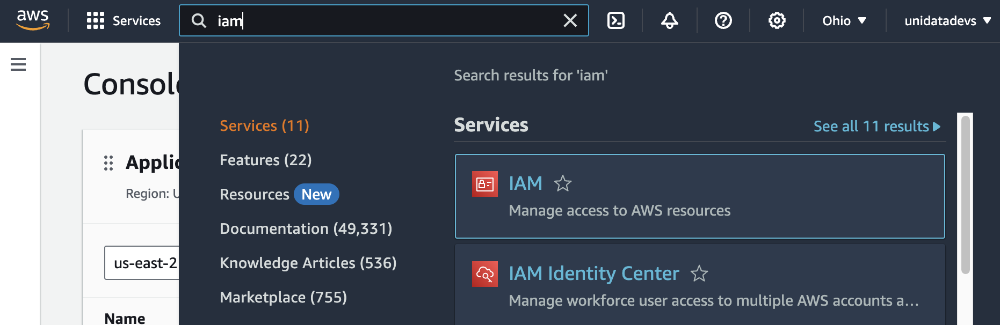
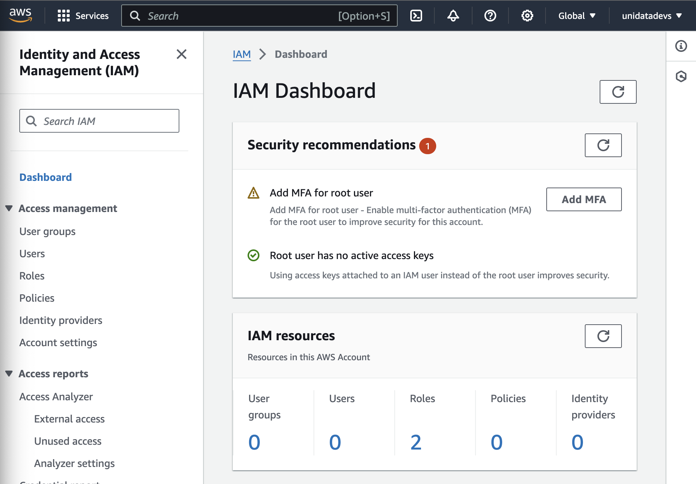
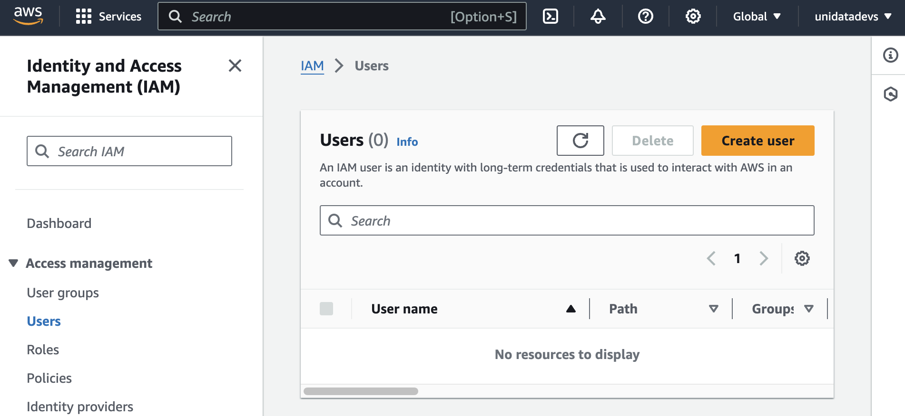
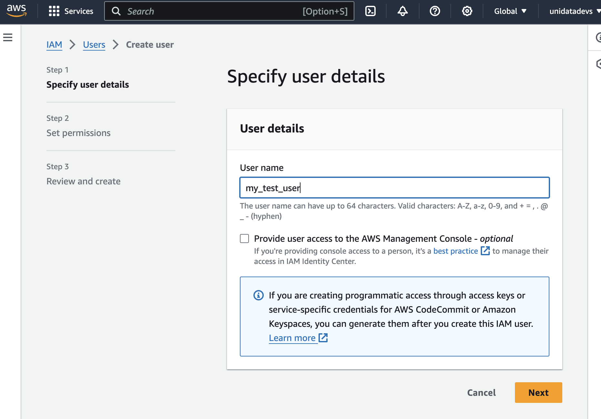
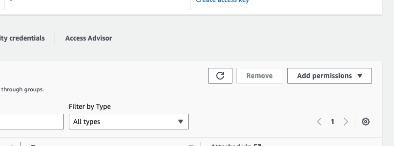
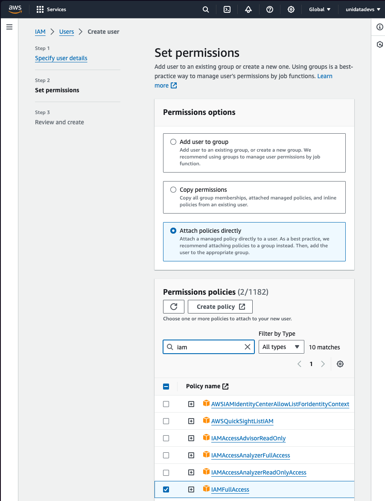
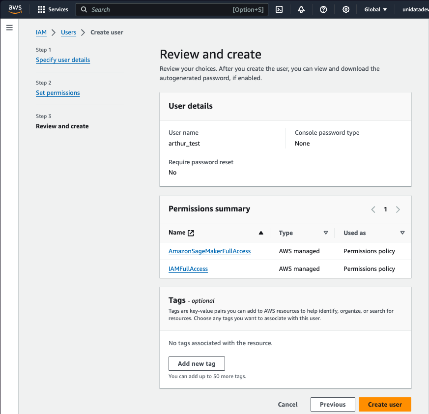
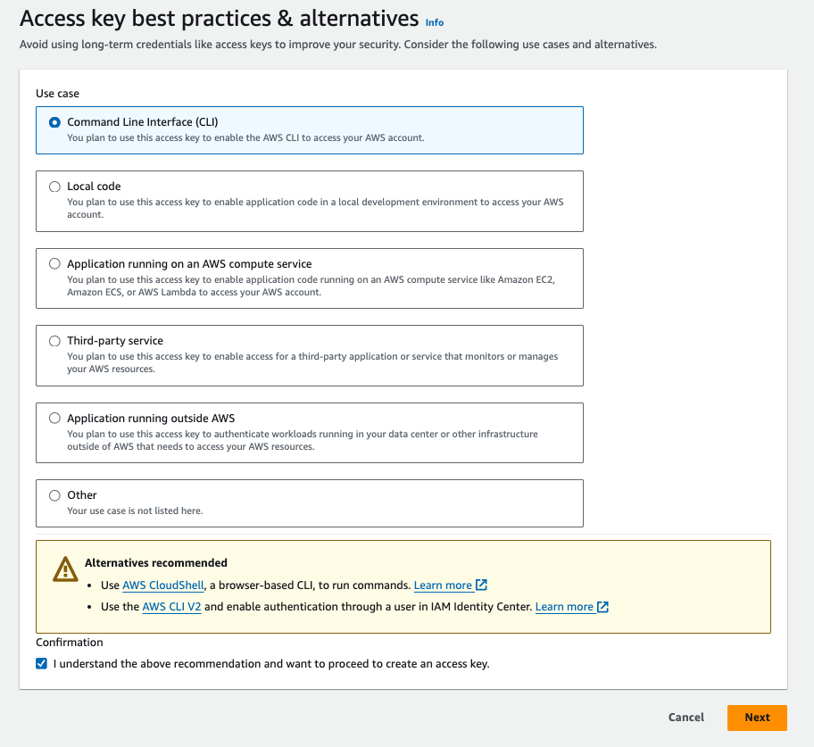
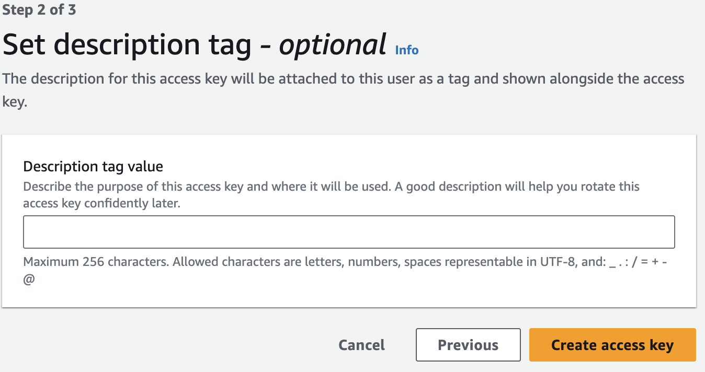
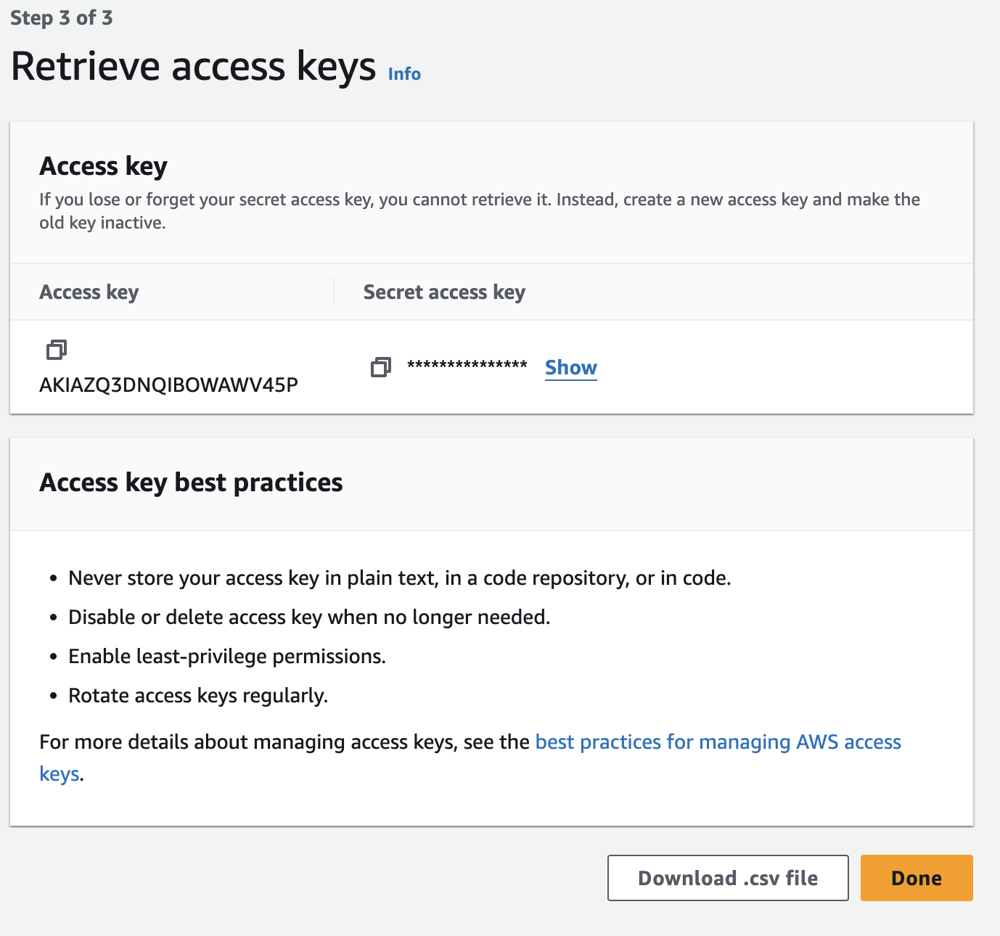

### AWS CLI

<Note>To install Azure SDK on MacOS, you need to have the latest OS and you need to use Rosetta terminal. Also, make sure you have the latest version of Xcode tools installed.</Note>

Follow this guide to install the latest AWS CLI

https://docs.aws.amazon.com/cli/latest/userguide/getting-started-install.html

Once you have the CLI installed and working, follow these steps

### AWS Account

<Steps>
<Step title="Create AWS Account">
Register for an [AWS account](https://aws.amazon.com/) and sign-in to the [console](https://console.aws.amazon.com/).
</Step>

<Step title="Navigate to IAM">
From the console, use the Search bar to find and select IAM (***do not use IAM Identity Center***, which is confusingly similar but a totally different system).

You should see the following screen after clicking IAM.

</Step>

<Step title="Create or Select User">
1. Select `Users` in the side panel
   

2. Create a user if you don't already have one

</Step>

<Step title="Add Required Permissions">
1. Click on "Add permissions"
   

2. Select "Attach policies directly". Under permission policies, search for and tick the boxes for:
   - `AmazonSagemakerFullAccess`
   - `IAMFullAccess`
   - `ServiceQuotasFullAccess`

Then click Next.

The final list should look like the following:

Click "Create user" on the following screen.
</Step>

<Step title="Generate Access Keys">
1. Click the name of the user you've just created (or one that already exists)
2. Go to "Security Credentials" tab
3. Scroll down to "Access Keys" section
4. Click "Create access key"
5. Select Command Line Interface then click next

Enter a description (this is optional, can leave blank). Then click next.

**Store BOTH the Access Key and the Secret access key for the next step. Once you've saved both keys, click Done.**

</Step>
</Steps>