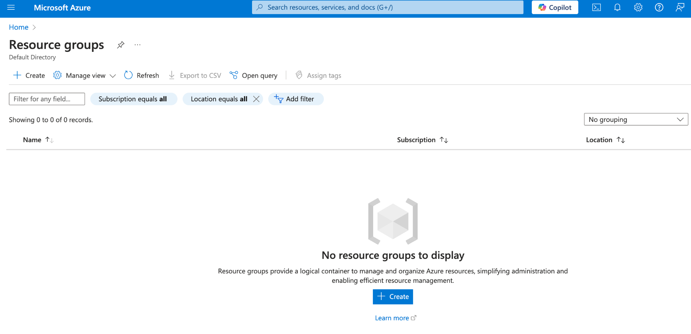
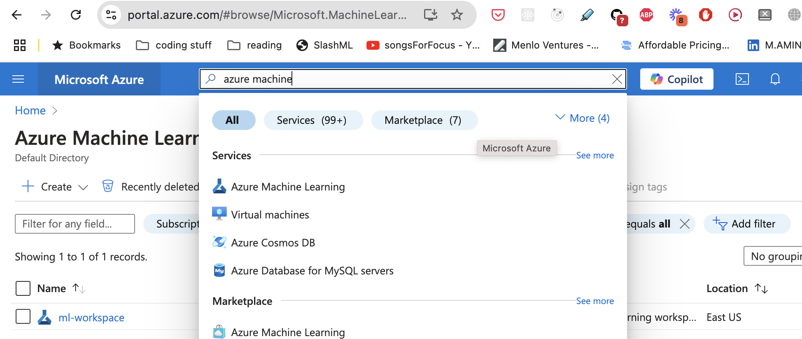
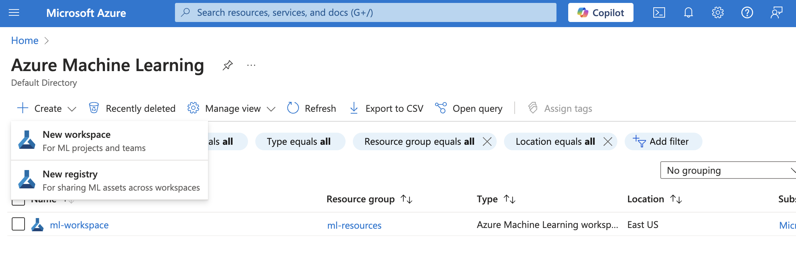

### Azure CLI

<Note>To install Azure SDK on MacOS, you need to have the latest OS and you need to use Rosetta terminal. Also, make sure you have the latest version of Xcode tools installed.</Note>


To install the latest Azure CLI, run:

```bash
brew update && brew install azure-cli
```

Alternatively, follow this official guide from Azure
- [https://learn.microsoft.com/en-us/cli/azure/install-azure-cli-macos](https://learn.microsoft.com/en-us/cli/azure/install-azure-cli-macos)

Once you have installed azure CLI, follow these steps


### Azure Account
Step 1: Create azure cloud account

- [https://azure.microsoft.com/en-ca](null)


<Steps>
  <Step title="Login to Azure">
    ```bash
    az login
    ```
  </Step>
  <Step title="Select Subscription">
    ```bash
    az account set --subscription <subscription-id>
    ```
  </Step>
  <Step title="Create Resource Group">

	From the terminal
    ```bash
    az group create --name <resource-group> --location <region>
    ```

	From the Azure Portal
	

  </Step>
  <Step title="Create ML Workspace">
    From the terminal
    ```bash
    az ml workspace create -n <workspace-name> -g <resource-group>
    ```

From the Azure portal
1. Search for `Azure Machine Learning` in the search bar.
	

2. Inside the `Azure Machine Learning` portal. Click on Create, and select `New Workspce` from the drop down
	

  </Step>
  <Step>
	```bash
	# Register all required providers: THIS STEP IS IMPORTANT
	az provider register --namespace Microsoft.MachineLearningServices
	az provider register --namespace Microsoft.ContainerRegistry
	az provider register --namespace Microsoft.KeyVault
	az provider register --namespace Microsoft.Storage
	az provider register --namespace Microsoft.Insights
	az provider register --namespace Microsoft.ContainerService
	az provider register --namespace Microsoft.PolicyInsights
	az provider register --namespace Microsoft.Cdn
   ```

   <Note>
     Registration can take up to 10 minutes. Check status with: ```bash az
     provider show -n Microsoft.MachineLearningServices ```
   </Note>

  </Step>
</Steps>