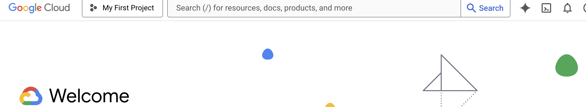
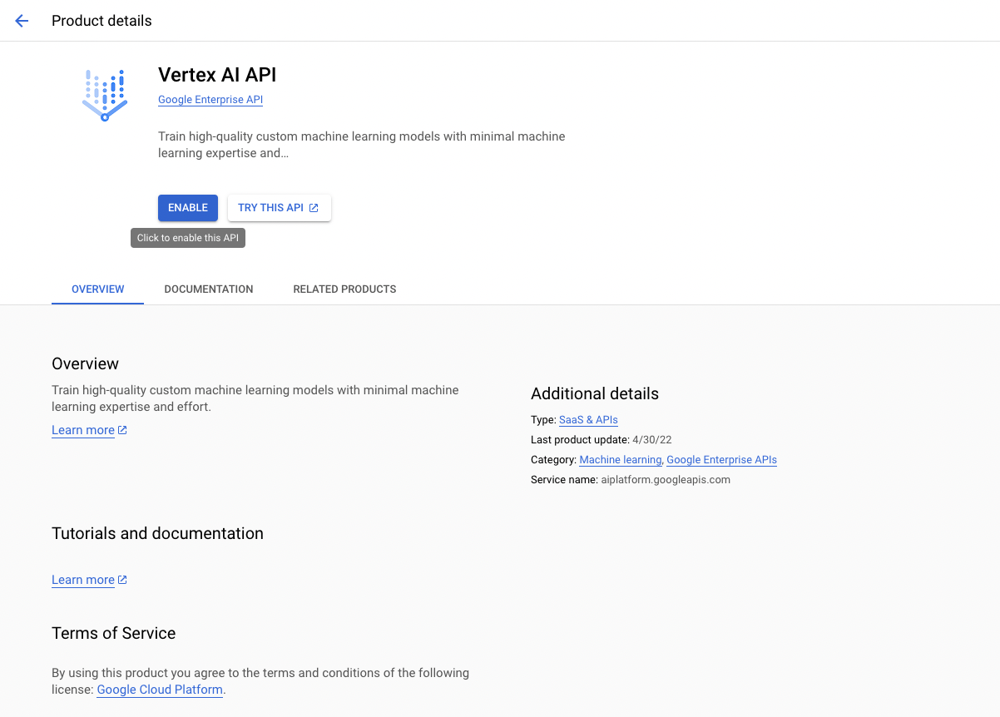

<Steps>
<Step title="Create Google Cloud Account">
Visit [Google Cloud Console](https://cloud.google.com/?hl=en) to create your account.
</Step>

<Step title="Create a new project">
	Once you have created your account, create a new project. If this is your first time the default project is "My First Project". You can create a new project by clicking this button and then selecting "New Project".

	

</Step>

<Step title="Install Google Cloud SDK">
1. Follow the installation guide at [Google Cloud SDK Installation Documentation](https://cloud.google.com/sdk/docs/install-sdk)
2. Initialize the SDK by running:
   ```bash
   gcloud init
   ```
</Step>

3. During initialization:
   - Create login credentials when prompted
   - Create a new project or select an existing one
   To make sure the initialization worked, run:
   ```bash
   gcloud auth application-default login
   ```

<Step title="Enable Vertex AI API">
Navigate to the APIs & Services on the dashboard and enable the Vertex AI API for your project.


</Step>

</Steps>