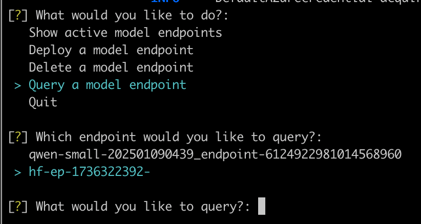

## Introduction
This tutorial guides you through deploying Llama 3 to AWS SageMaker using Magemaker and querying it using the interactive dropdown menu. Ensure you have followed the [installation](installation) steps before proceeding.

## Step 1: Setting Up Magemaker for AWS

Run the following command to configure Magemaker for AWS SageMaker deployment:

```sh
magemaker --cloud aws
```

This initializes Magemaker with the necessary configurations for deploying models to SageMaker.

## Step 2: YAML-based Deployment

For reproducible deployments, use YAML configuration:

```sh
magemaker --deploy .magemaker_config/your-model.yaml
```

Example YAML for AWS deployment:

```yaml
deployment: !Deployment
  destination: aws
  endpoint_name: llama3-endpoint
  instance_count: 1
  instance_type: ml.g5.2xlarge
  num_gpus: 1
  quantization: null

models:
  - !Model
    id: meta-llama/Meta-Llama-3-8B-Instruct
    location: null
    predict: null
    source: huggingface
    task: text-generation
    version: null
```

<Note>
   For gated models like llama from Meta, you have to accept terms of use for model on hugging face and adding Hugging face token to the environment are necessary for deployment to go through.
</Note>


<Warning> 
You may need to request a quota increase for specific machine types and GPUs in the region where you plan to deploy the model. Check your AWS quotas before proceeding. 
</Warning>

## Step 3: Querying the Deployed Model

Once the deployment is complete, note down the endpoint id.

You can use the interactive dropdown menu to quickly query the model.

### Querying Models

From the dropdown, select `Query a Model Endpoint` to see the list of model endpoints. Press space to select the endpoint you want to query. Enter your query in the text box and press enter to get the response.



Or you can use the following code:
```python 
from sagemaker.huggingface.model import HuggingFacePredictor
import sagemaker


def query_huggingface_model(endpoint_name: str, query: str):
    # Initialize a SageMaker session
    sagemaker_session = sagemaker.Session()
    
    # Create a HuggingFace predictor
    predictor = HuggingFacePredictor(
        endpoint_name=endpoint_name,
        sagemaker_session=sagemaker_session
    )
    
    # Prepare the input
    input_data = {
        "inputs": query
    }
    
    try:
        # Make prediction
        result = predictor.predict(input_data)
        print(result)
        return result
    except Exception as e:
        print(f"Error making prediction: {str(e)}")
        raise e

# Example usage
if __name__ == "__main__":
    # Replace with your actual endpoint name
    ENDPOINT_NAME = "your-deployed-endpoint"
    
    # Your test question
    question = "what are you?"
    
    # Make prediction
    response = query_huggingface_model(ENDPOINT_NAME, question)
```
## Conclusion
You have successfully deployed and queried Llama 3 on AWS SageMaker using Magemaker's interactive dropdown menu. For any questions or feedback, feel free to contact us at [support@slashml.com](mailto:support@slashml.com).
