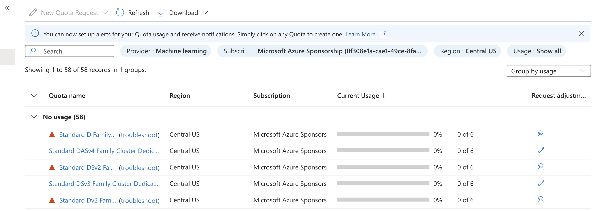

## Introduction
This tutorial guides you through deploying Llama 3 to Azure ML platform using Magemaker and querying it using the interactive dropdown menu. Ensure you have followed the [installation](installation) steps before proceeding. 

<Note> 
You may need to request a quota increase for specific machine types and GPUs in the region where you plan to deploy the model. Check your Azure quotas before proceeding. 
</Note>

<Note>
  The model ids for Azure are different from AWS and GCP. Make sure to use the one provided by Azure in the Azure Model Catalog. 

  To find the relevnt model id, follow the steps in the [quick start](For Azure ML)
</Note>

## Step 1: Setting Up Magemaker for Azure

Run the following command to configure Magemaker for Azure deployment:

```sh
magemaker --cloud azure
```

This initializes Magemaker with the necessary configurations for deploying models to Azure ML Studio.

## Step 2: YAML-based Deployment

For reproducible deployments, use YAML configuration:

```sh
magemaker --deploy .magemaker_config/your-model.yaml
```

Example YAML for Azure deployment:

```yaml
deployment: !Deployment
  destination: azure
  endpoint_name: llama3-endpoint
  instance_count: 1
  instance_type: Standard_NC24ads_A100_v4 

models:
  - !Model
    id: meta-llama-meta-llama-3-8b-instruct
    location: null
    predict: null
    source: huggingface
    task: text-generation
    version: null
```

<Note>
   For gated models like llama from Meta, you have to accept terms of use for model on hugging face and adding Hugging face token to the environment are necessary for deployment to go through.
</Note>

### Selecting an Appropriate Instance
For 8B parameter models, recommended instance types include:

- Standard_NC24ads_A100_v4 (optimal performance)
- Standard_NC24s_v3 (cost-effective option with V100)

<Warning>
If you encounter quota issues, submit a quta increase request in the Azure console. In the search bar search for `Quotas` and select the subscription you are using. In the `provider` select `Machine Learning` and then select the relevant region for the quota increase


</Warning>

## Step 3: Querying the Deployed Model

Once the deployment is complete, note down the endpoint id.

You can use the interactive dropdown menu to quickly query the model.

### Querying Models

From the dropdown, select `Query a Model Endpoint` to see the list of model endpoints. Press space to select the endpoint you want to query. Enter your query in the text box and press enter to get the response.


Or you can use the following code

```python 

from azure.identity import DefaultAzureCredential
from azure.ai.ml import MLClient
from azure.mgmt.resource import ResourceManagementClient

from dotenv import dotenv_values
import os


def query_azure_endpoint(endpoint_name, query):
    # Initialize the ML client
    subscription_id   = dotenv_values(".env").get("AZURE_SUBSCRIPTION_ID")
    resource_group    = dotenv_values(".env").get("AZURE_RESOURCE_GROUP")
    workspace_name    = dotenv_values(".env").get("AZURE_WORKSPACE_NAME")

    credential = DefaultAzureCredential()
    ml_client = MLClient(
        credential=credential,
        subscription_id=subscription_id,
        resource_group_name=resource_group,
        workspace_name=workspace_name
    )

    import json

    # Test data
    test_data = {
        "inputs": query
    }

    # Save the test data to a temporary file
    with open("test_request.json", "w") as f:
        json.dump(test_data, f)

    # Get prediction
    response = ml_client.online_endpoints.invoke(
        endpoint_name=endpoint_name,
        request_file = 'test_request.json'
    )

    print('Raw Response Content:', response)
    # delete a file
    os.remove("test_request.json")
    return response
    
endpoint_id = 'your-endpoint-id-here'
    
input_text = 'What are you?'


resp = query_azure_endpoint(endpoint_id=endpoint_id, input_text=input_text)
print(resp)

```

## Conclusion
You have successfully deployed and queried Llama 3 on Azure using Magemaker's interactive dropdown menu. For any questions or feedback, feel free to contact us at [support@slashml.com](mailto:support@slashml.com).

